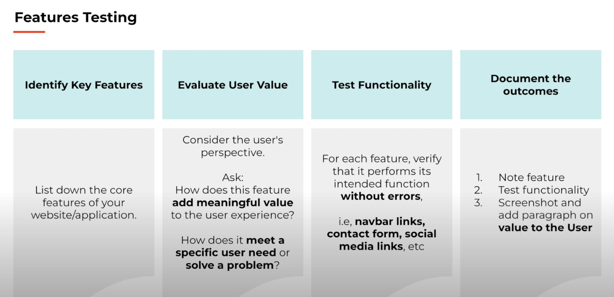

<-- Image from AmIResponsive https://ui.dev/amiresponsive -->

# CSS Methodology
Block Element Modifier - this was chosen over other methodologies (e.g. Object Oriented CSS) because of its scalability and clarity of relationship between HTML and CSS

# Testing 
    <-- check out this video for more information https://www.youtube.com/watch?v=Q66HZgkDSOo -->
## Features Testing

| Column 1 | Column 2 | Column 3 | Column 4 |
|----------|----------|----------|----------|
|   Data   |   Data   |   Data   |   Data   |
|   Data   |   Data   |   Data   |   Data   |

## Browser Compatability
| Column 1 | Column 2 | Column 3 | Column 4 |
|----------|----------|----------|----------|
|   Data   |   Data   |   Data   |   Data   |
|   Data   |   Data   |   Data   |   Data   |

## Responsiveness
## Code Validation
## Bugs
## Lighthouse
## Accessibility

